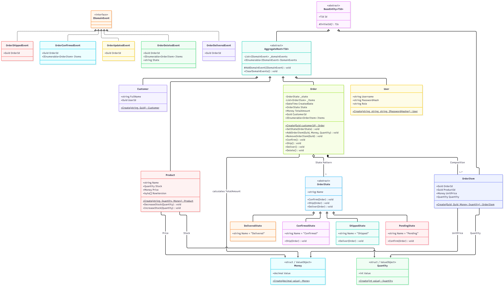

<div dir="rtl">

# سیستم مدیریت سفارشات فروشگاه آنلاین (Order Management Service)

یک وب‌سرویس سازمانی، با کارایی بالا و مقیاس‌پذیر برای مدیریت چرخه عمر سفارشات، مبتنی بر **.NET 9**، معماری تمیز (**Clean Architecture**)، اصول طراحی دامنه-محور (**Domain-Driven Design - DDD**) و الگوی **CQRS**.

---

## فهرست مندرجات
1. [ویژگی‌ها و قابلیت‌های کلیدی](#۱-ویژگیها-و-قابلیتهای-کلیدی)
2. [راهنمای راه‌اندازی و اجرای محلی (Local Setup & Run)](#۲-راهنمای-راهاندازی-و-اجرای-محلی-local-setup--run)
3. [نحوه دریافت توکن JWT تستی و اطلاعات کاربران Seed شده](#۳-نحوه-دریافت-توکن-jwt-تستی-و-اطلاعات-کاربران-seed-شده)
4. [معماری سیستم و تصمیمات کلیدی طراحی (Architecture & ADRs)](#۴-معماری-سیستم-و-تصمیمات-کلیدی-طراحی-architecture--adrs)
5. [نمودار کلاس و مدل دامنه (Domain UML Diagram)](#۵-نمودار-کلاس-و-مدل-دامنه-domain-uml-diagram)
6. [دستور اجرای تست‌های واحد و گزارش پوشش کد (Running Tests & Coverage)](#۶-دستور-اجرای-تستهای-واحد-و-گزارش-پوشش-کد-running-tests--coverage)
7. [مستندات API و نقاط دسترسی (Swagger & Endpoints)](#۷-مستندات-api-و-نقاط-دسترسی-swagger--endpoints)
8. [ساختار پروژه و درخت دایرکتوری‌ها](#۸-ساختار-پروژه-و-درخت-دایرکتوریها)

---

## ۱. ویژگی‌ها و قابلیت‌های کلیدی

- **طراحی دامنه-محور با مدل غنی (Rich Domain Model):** کپسوله‌سازی کامل قوانین بیزنس در Aggregate Root سفارش و نفی مدل کم‌خون (Anemic Domain Model).
- **الگوی ماشین وضعیت شیءگرا (State Pattern):** هدایت انتقال‌های مجاز چرخه سفارش (`Pending` ➔ `Confirmed` ➔ `Shipped` ➔ `Delivered`) و منع ترنزیشن‌های نامعتبر در ریشه دامنه.
- **کنترل همزمانی خوش‌بینانه (Optimistic Concurrency Control):** پیشگیری قطعی از پدیده فروش بیش از موجودی (Overselling / Race Conditions) با `RowVersion` روی موجودیت کالا و پاسخ خودکار `409 Conflict`.
- **الگوی Transactional Outbox:** انتشار رویدادهای دامنه و پایداری اتمیک داده‌ها جهت تضمین یکپارچگی بدون خطر Dual-Write.
- **امنیت قیمت‌گذاری (Price Tampering Defense):** حذف کامل امکان تزریق قیمت توسط کلاینت؛ محاسبه قطعی و معتبر قیمت از کاتالوگ پایگاه داده.
- **بازگردانی خودکار انبار (Restock Invariant):** افزایش خودکار موجودی انبار هنگام حذف سفارش‌های تأییدشده.
- **رصدپذیری پیشرفته (Observability & Replay):** ثبت ساختاریافته ورودی و خروجی با `CorrelationId` یکتا، ماسک‌گذاری خودکار کلمات عبور و پشتیبانی از تکنیک Record/Replay جهت بازتولید خطاها.
- **پوشش تست استثنایی:** سوئیت ۱۷۱ تستی منطبق بر کتاب ولادیمیر خوریکوو با پوشش خطی **۹۸.۲٪ در Application** و **۸۶.۱٪ در Domain**.

---

## ۲. راهنمای راه‌اندازی و اجرای محلی (Local Setup & Run)

### پیش‌نیازها
- **.NET 9 SDK** (یا بالاتر)
- **Microsoft SQL Server** (یا LocalDB / Docker SQL Server)

### ۱. تنظیم رشته اتصال پایگاه داده
فایل تنظیمات [appsettings.json](file:///d:/OrderManagementService/OrderManagementService/OrderManagementService.WebApi/OrderManagementService/appsettings.json) را در صورت نیاز بر اساس سرور پایگاه داده خود ویرایش فرمایید:

</div>

<div dir="ltr">

```json
"ConnectionStrings": {
  "DefaultConnection": "Server=.;Database=OrderServiceManagement;Trusted_Connection=True;TrustServerCertificate=True"
}
```

</div>

<div dir="rtl">

### ۲. اعمال خودکار مایگریشن‌ها و Seed Data
پروژه مجهز به متد خودکار `ApplyMigrationsAndSeedAsync` است. به محض اجرای برنامه، آخرین مایگریشن‌های EF Core اعمال شده و به صورت خودکار **۵۰ کاربر و مشتری** و **۲۰۰ محصول تجاری متنوع** در دیتابیس Seed می‌شوند؛ بنابراین **هیچ نیازی به اجرای دستی دستورات مایگریشن در کنسول نیست**.

چنانچه تمایل به اعمال دستی از طریق ترمینال داشته باشید:

</div>

<div dir="ltr">

```bash
dotnet ef database update --project OrderManagementService.Infrastructure --startup-project OrderManagementService
```

</div>

<div dir="rtl">

### ۳. دستور اجرای وب‌سرویس
برای اجرای سرویس، در مسیر پروژه دستور زیر را اجرا کنید:

</div>

<div dir="ltr">

```bash
dotnet run --project OrderManagementService
```

</div>

<div dir="rtl">

### ۴. آدرس دسترسی به Swagger UI
پس از اجرای پروژه، مستندات تعاملی Swagger در آدرس‌های زیر در دسترس است:

</div>

<div dir="ltr">

- **HTTPS:** `https://localhost:7207/swagger`
- **HTTP:** `http://localhost:5015/swagger`

</div>

<div dir="rtl">

---

## ۳. نحوه دریافت توکن JWT تستی و اطلاعات کاربران Seed شده

سیستم احراز هویت مبتنی بر **JWT Bearer Token** و مجهز به هشینگ امن **PBKDF2 با سالت اختصاصی ۱۶ بایتی و ۱۰۰,۰۰۰ تکرار SHA256** است.

### کاربران از پیش ثبت‌شده در Seed Data:

</div>

<div dir="ltr">

| Username | Password | Role | Description |
| :--- | :--- | :---: | :--- |
| **`admin`** | **`Admin@123`** | **Admin** | Full Admin privileges + **Permission to delete orders** |
| **`testuser`** | **`User@123`** | **User** | Standard operations: create, track, confirm, ship, filter |
| *(48 others)* | `Password123` | **User** | Seeded customers for realistic query and pagination tests |

</div>

<div dir="rtl">

### نحوه دریافت توکن (Login):
یک درخواست `POST` به اندپوینت `/api/auth/login` ارسال فرمایید:

</div>

<div dir="ltr">

```http
POST /api/auth/login
Content-Type: application/json

{
  "username": "admin",
  "password": "Admin@123"
}
```

#### نمونه پاسخ:
```json
{
  "token": "eyJhbGciOiJIUzI1NiIsInR5cCI6IkpXVCJ9..."
}
```

</div>

<div dir="rtl">

### احراز هویت در Swagger UI:
1. روی دکمه سبز رنگ **Authorize 🔓** در بالای صفحه Swagger کلیک کنید.
2. توکن دریافتی را بدون پیشوند یا تغییر در کادر ورودی وارد نمایید:

</div>

<div dir="ltr">

```text
eyJhbGciOiJIUzI1NiIsInR5cCI6IkpXVCJ9...
```

</div>

<div dir="rtl">

3. روی دکمه **Authorize** و سپس **Close** کلیک فرمایید. از این پس تمامی درخواست‌ها با هویت و نقش مربوطه ارسال می‌شوند.

---

## ۴. معماری سیستم و تصمیمات کلیدی طراحی (Architecture & ADRs)

### ۱. معماری تمیز چهارلایه (Clean Architecture)
پروژه از قانون سخت‌گیرانه **Dependency Rule** تبعیت می‌کند؛ وابستگی‌ها همواره به سمت داخل اشاره دارند:

</div>

<div dir="ltr">

```text
OrderManagementService (WebApi)
    │
    ▼
OrderManagementService.Infrastructure
    │
    ▼
OrderManagementService.Application
    │
    ▼
OrderManagementService.Domain (Pure Core)
```

</div>

<div dir="rtl">

- **عدم ایجاد پروژه مجزای Common:** ایجاد یک پروژه عمومی به نام Common به مرور زمان منجر به ضدالگوی «جعبه ضایعات یا Junk Drawer» می‌شود. در این پروژه، تعاریف مشترک دامین در همان لایه دامین (`Domain.Entities.Base`) و تعاریف مشترک اپلیکیشن در لایه اپلیکیشن (`Application.Common`) نگهداری شده تا انضباط کامل مرزها حفظ شود.

### ۲. طراحی دامنه-محور (DDD) و اشیاء ارزش (Value Objects)
- موجودیت‌های `Order`، `Product`، `Customer` و `User` کپسوله بوده و امکان دستکاری فیلدها از خارج موجودیت وجود ندارد.
- اشیاء ارزش `Money` و `Quantity` به صورت `readonly record struct` پیاده‌سازی شدند تا علاوه بر برابری مقداری (Value Equality)، بار اضافی به Garbage Collector تحمیل نکنند (تخصیص روی پشته حافظه).
- ساخت نمونه‌ها منحصراً از طریق **Static Factory Method** (مانند `Money.Create`) انجام می‌شود تا آبجکت نتواند در وضعیتی نامعتبر یا منفی ساخته شود.

### ۳. الگوی وضعیت (State Pattern) برای چرخه عمر سفارش
به جای استفاده از `enum` و زنجیره‌های شکننده `switch/case` (که اصل Open/Closed را نقض می‌کنند)، رفتار وضعیت سفارش با **State Pattern** پیاده‌سازی شده است:
- کلاس پایه `OrderState` و کلاس‌های وضعیت انضمامی: `PendingState`, `ConfirmedState`, `ShippedState`, `DeliveredState`.
- هر وضعیت صرفاً انتقال مجاز خودش را بازنویسی می‌کند:
  - `Pending` فقط اجازه انتقال به `Confirmed` را می‌دهد.
  - `Confirmed` فقط اجازه انتقال به `Shipped` را می‌دهد.
  - `Shipped` فقط اجازه انتقال به `Delivered` را می‌دهد.
  - `Delivered` وضعیت نهایی است.
- سفارش‌های در وضعیت `Shipped` و `Delivered` طبق قانون دامنه (`OrderCanBeDeletedValidation`) غیرقابل حذف هستند.

### ۴. کنترل همزمانی خوش‌بینانه (Optimistic Concurrency Control)
برای مقابله با شرایط رقابتی (Race Conditions) و جلوگیری از فروش همزمان آخرین موجودی کالا به دو خریدار:
- انتیتی `Product` مجهز به فیلد `RowVersion` از نوع `byte[]` با کانفیگ `.IsRowVersion()` در EF Core است.
- در صورت تغییر موازی رکورد، خطای همزمانی `DbUpdateConcurrencyException` صادر شده و میان‌افزار مرکزی آن را به پاسخ استاندارد **HTTP 409 Conflict** تبدیل می‌کند.

### ۵. امنیت در قیمت‌گذاری و بازگردانی انبار
- **Price Tampering Defense:** کلاینت حق تعیین قیمت ندارد؛ فیلد `UnitPrice` از تمامی DTOهای ورودی حذف شده و سیستم به صورت رسمی قیمت را از کاتالوگ انتیتی `Product` استخراج و ثبت می‌کند.
- **Restock Invariant:** در صورتی که سفارش تأییدشده (`Confirmed`) حذف گردد، رویداد `OrderDeletedEvent` ساطع شده و هندلر `OrderDeletedEventHandler` موجودی کلیه اقلام سفارش را به انبار بازمی‌گرداند.

### ۶. الگوی Transactional Outbox
رویدادهای دامنه در همان تراکنش واحد دیتابیسی سفارش، در جدول `OutboxMessages` ذخیره می‌شوند تا از خطای Dual-Write جلوگیری شده و پایداری اتمیک تضمین گردد. یک فرآیند پس‌زمینه (Quartz Job)، رویدادها را با تضمین تحویل حداقل یک‌بار (At-Least-Once Delivery) پردازش می‌کند.

### ۷. تفکیک خواندن و نوشتن با CQRS و پایپ‌لاین MediatR
- **مسیر Write:** متکی به ریپازیتوری‌های دستوری، Aggregate Root و Unit of Work.
- **مسیر Read:** ریپازیتوری‌های استعلامی مستقیم با `.AsNoTracking()` و نگاشت مستقیم به DTOهای سبک، همراه با اجرای صفحه‌بندی در سطح دیتابیس (SQL Skip/Take).
- **لاگینگ و رصدپذیری (Observability):** کلاس `LoggingBehavior` در خط لوله MediatR برای هر درخواست یک `CorrelationId` تولید کرده، زمان دقیق اجرا را ثبت می‌کند و رمزهای عبور را به صورت خودکار با `***MASKED***` مخفی می‌سازد. همچنین به واسطه ثبت ورودی/خروجی، امکان بازتولید و شبیه‌سازی باگ‌ها با تکنیک **Record/Replay** میسر است.

---

## ۵. نمودار کلاس و مدل دامنه (Domain UML Diagram)

برای درک عمیق و بصری ساختار دامنه، ارتباط بین اگریگیت‌ها (`Order`, `Product`, `Customer`, `User`)، اشیاء ارزش (`Money`, `Quantity`)، قوانین بیزنس و پیاده‌سازی ماشین وضعیت سفارش با الگوی **State Pattern**، دیاگرام جامع UML زیر را مشاهده فرمایید:

<div align="center">



*فایل با کیفیت اصلی در مسیر [docs/diagrams/OrderManagementServiceUML.png](docs/diagrams/OrderManagementServiceUML.png) در دسترس است.*

</div>

---

## ۶. دستور اجرای تست‌های واحد و گزارش پوشش کد (Running Tests & Coverage)

سوئیت آزمون پروژه [OrderManagementService.UnitTests](OrderManagementService.UnitTests) بر اساس ۴ رکن کتاب **Vladimir Khorikov** (مقاومت در برابر ریفکتورینگ، محافظت در برابر رگرسیون، بازخورد سریع، قابلیت نگهداری) طراحی شده است:
- ساختار دقیق **Arrange-Act-Assert (AAA)** و نام‌گذاری متغیر تحت آزمون با **`sut`**.
- بهره‌گیری از الگوهای **Test Data Builder** و **Object Mother** برای خوانایی و تست‌های خود-مستندساز.
- نام‌گذاری داستان‌سرایانه (Story-telling) بدون کلمات کلیشه‌ای (`Should/When/Given`).
- آزمون‌های منحصراً مبتنی بر خروجی و تغییر وضعیت (Output-based / State-based) جهت تضمین مقاومت کامل در برابر تغییرات داخلی کد.

### دستور اجرای آزمون‌ها:

</div>

<div dir="ltr">

```bash
dotnet test OrderManagementService.UnitTests/OrderManagementService.UnitTests.csproj
```

</div>

<div dir="rtl">

### دستور جمع‌آوری گزارش پوشش کد (Coverage):

</div>

<div dir="ltr">

```bash
dotnet test OrderManagementService.UnitTests/OrderManagementService.UnitTests.csproj --collect:"XPlat Code Coverage"
```

</div>

<div dir="rtl">

### جدول نتایج و آمار پوشش کد:

</div>

<div dir="ltr">

| Layer Under Test | Line Coverage | Branch Coverage | Test Results |
| :--- | :---: | :---: | :---: |
| **`OrderManagementService.Application`** | **98.2 %** | **92.9 %** | 100% Passed |
| **`OrderManagementService.Domain`** | **86.1 %** | **81.3 %** | 100% Passed |
| **Total Test Suite** | **171 Tests** | **0 Failures** | **Execution Duration: ~150 ms** |

</div>

<div dir="rtl">

---

## ۷. مستندات API و نقاط دسترسی (Swagger & Endpoints)

وب‌سرویس شامل مجموعه‌ای جامع از اندپوینت‌های RESTful است:

### احراز هویت (Authentication):
- `POST /api/auth/login`: اعتبارسنجی کاربر و صدور JWT Token.

### مدیریت سفارشات (Orders):
- `POST /api/orders`: ثبت سفارش جدید چندمحصوله (قیمت‌گذاری خودکار از کاتالوگ).
- `POST /api/orders/bulk`: ثبت دسته‌ای سفارشات به صورت تراکنشی و بهینه.
- `GET /api/orders/{id}`: دریافت جزئیات کامل سفارش و اقلام آن بر اساس شناسه.
- `GET /api/orders`: جستجو و فیلتر سفارش‌ها بر اساس `CustomerId`، `OrderStatus` و بازه زمانی `StartDate`/`EndDate` همراه با صفحه‌بندی (`Page` و `Size`).
- `PUT /api/orders/{id}/confirm`: تایید سفارش و کسر موجودی انبار پس از اعتبارسنجی موجودی.
- `PUT /api/orders/{id}/ship`: تغییر وضعیت سفارش از Confirmed به Shipped.
- `PUT /api/orders/{id}/deliver`: تغییر وضعیت سفارش از Shipped به Delivered.
- `DELETE /api/orders/{id}`: حذف سفارش (مخصوص کاربر با نقش **Admin**؛ با بازگردانی خودکار موجودی برای سفارش‌های تأییدشده).

---

## ۸. ساختار پروژه و درخت دایرکتوری‌ها

</div>

<div dir="ltr">

```text
OrderManagementService/
├── docs/                                    # Architectural Documentation & Diagrams
│   ├── diagrams/                            # Visual Diagrams (OrderManagementServiceUML.png)
│   ├── Architecture_And_Design_Decisions_Defense.md
│   └── 05_Unit_Tests_Documentation.md
│
├── OrderManagementService/                  # Presentation Layer (WebApi)
│   ├── Controllers/                         # RESTful API Controllers
│   ├── Activators/Middlewares/              # Global Exception Handling & Middlewares
│   ├── Extensions/                          # DI, Authentication & Database Auto-Migration
│   ├── Program.cs                           # App Pipeline Configuration
│   └── appsettings.json                     # Connection Strings & JWT Configurations
│
├── OrderManagementService.Application/       # Application Layer (Use Cases & Workflows)
│   ├── Commands/                            # CQRS Commands & Command Handlers
│   ├── Queries/                             # CQRS Queries & Query Handlers
│   ├── Events/                              # Domain Event Handlers (Restock on Deletion)
│   ├── PipelineBehaviors/                   # MediatR Logging, Observability & Validation
│   └── Common/                              # Pagination & Shared Application DTOs
│
├── OrderManagementService.Domain/            # Domain Core (Entities, Invariants & Logic)
│   ├── Entities/                            # Aggregates: Order, Product, Customer, User
│   ├── Entities/States/                     # State Pattern: Pending, Confirmed, Shipped, Delivered
│   ├── Entities/ValueObjects/               # Value Objects: Money, Quantity
│   ├── Entities/Rules/                      # Domain Invariants & Business Validations
│   └── Services/                            # Domain Services: OrderConfirmation, UserPassword
│
├── OrderManagementService.Infrastructure/    # Infrastructure Layer (Data & External Services)
│   ├── Data/                                # DbContext & EF Core Fluent API Configurations
│   ├── Data/Migrations/                     # Code-First Database Migrations
│   ├── Data/Seeding/                        # Automated Seeder: 50 Users, 50 Customers, 200 Products
│   ├── Repositories/                        # Command & Query Repositories
│   ├── Security/                            # PBKDF2 Password Hashing
│   └── Outbox/                              # Transactional Outbox Background Processor (Quartz)
│
└── OrderManagementService.UnitTests/         # Comprehensive Unit Testing Suite
    ├── Common/                              # Test Data Builders & Object Mothers
    ├── Domain/                              # Domain Unit Tests (Aggregates, States, Services)
    ├── Application/                         # Application Tests (Commands, Queries, Behaviors)
    └── Infrastructure/                      # Infrastructure Security Tests (PBKDF2)
```

</div>
